# TriggerSync Automation

## V-Portal User

- Create a user in the respective V-Portal and assign projects
    
    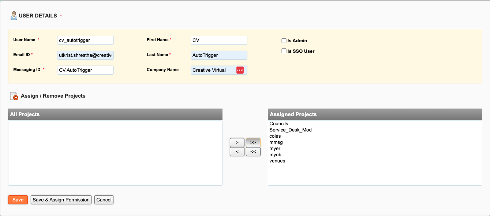
    
- Set the password give assign minimum permission
- Open the V-Portal project through this account and reset the password
- Go to V-Portal database and then to `vportal_users.user_profile`
- Set the extend the password expiry date

## Set Environment Variable

1. Go to the respective server hosting the automation script
2. Click on **Start** and search for **Environment** **Variable**
    
    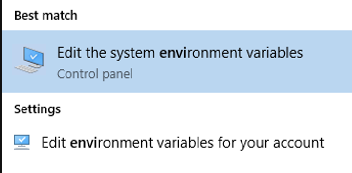
    
3. Click on **Environment** **Variable**
    
    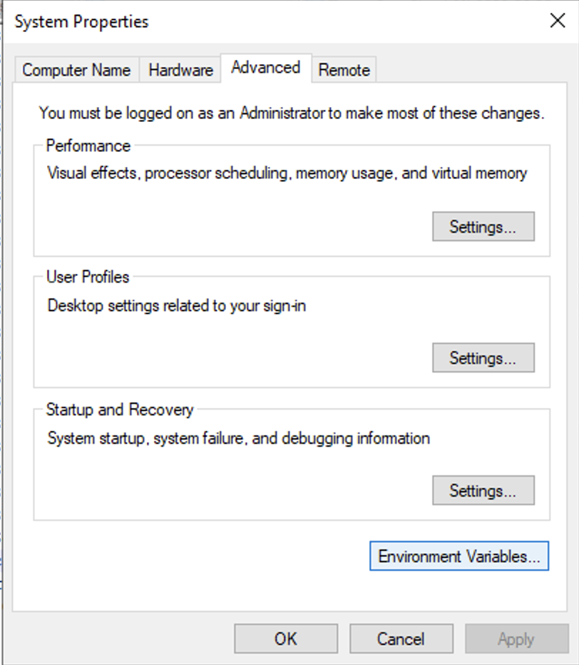
    
4. Click on **New**
    
    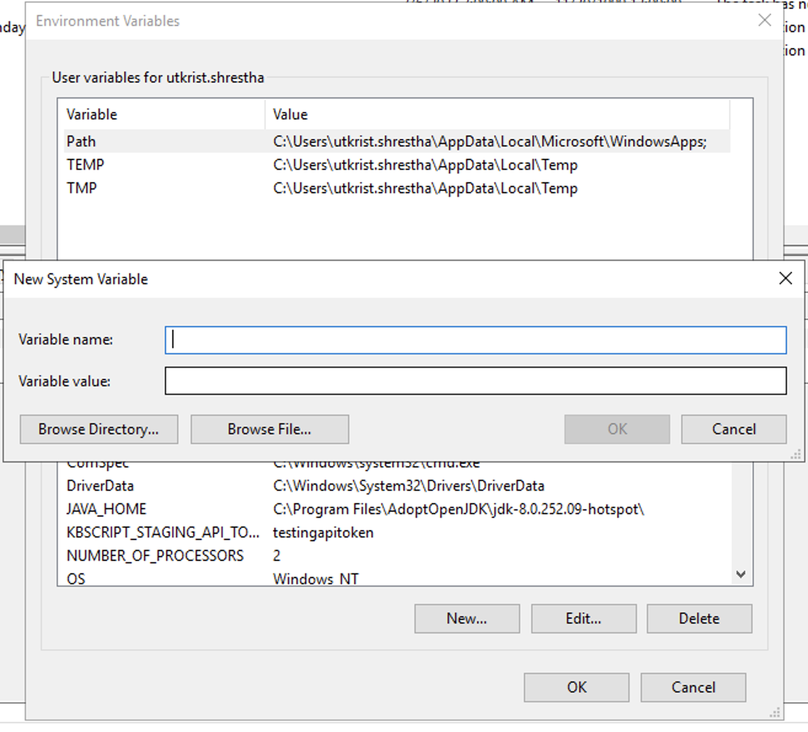
    
5. Set the V-Portal Username and and V-Portal Password as:
    - VP-Username
    - VP-Password
    - Slack_Bot_API_Token

## Selenium File

1. Import Selenium file in `C:\Selenium\AutoTriggerSync`
2. Edit `C:\Selenium\AutoTriggerSync\config.ini` as required
3. Open **Command Prompt** as an **Administrator,** Install python library
    
    ```bash
    pip install -r requirements.txt
    ```
    
4. When new package is added
    
    ```bash
    pip freeze > requirements.txt
    ```
    

## Schedule Automation

- Go to Task Scheduler > Create Task
    
    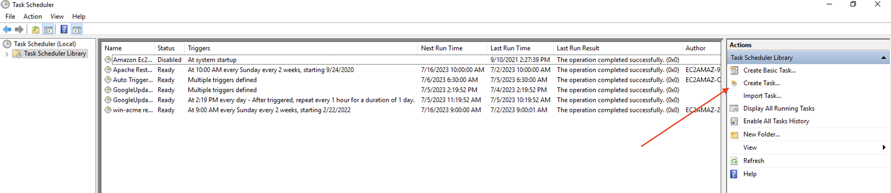
    
- General
    1. In the “Name” box, enter a name for the task.
    2. In the “General” tab, under the “Security options” section, select the “**Run whether user is logged on or not”** option. (This option will make the command window not appear when the task runs automatically.)
        
        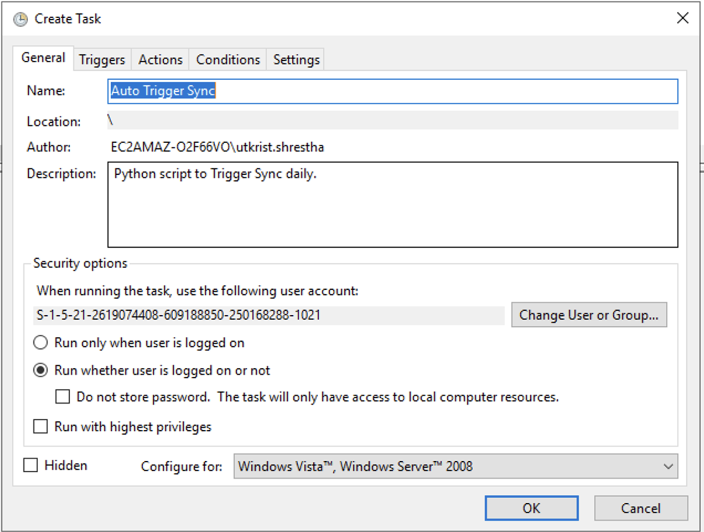
        
- Triggers
    1. Click the “Triggers” tab, and click the **New** button.
    2. Select the **“On a schedule”** option using the “Begin the task” setting.
    3. Under “Settings,” specify when you want the task to run (for example, On time, Daily, Weekly, or Monthly). Whatever option you select, set the **Start** settings on the right side.
        
        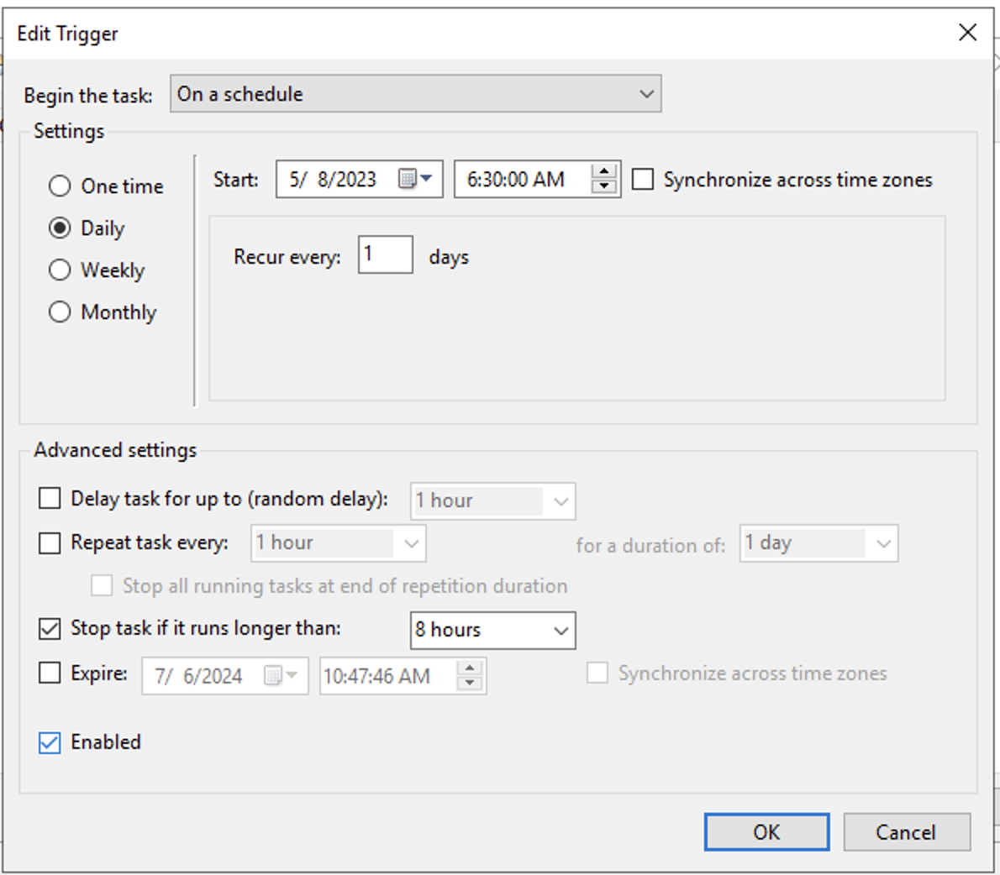
        
- Action
    1. Click the “Actions” tab, and click the **New** Button.
    2. Use the “Actions” drop-down menu and select the **“Start a program”** option.
    3. In the “Program/script” box, type the following command:
        
        ```
        "C:\Program Files\Python37\python.exe"
        ```
        
    4. Type the following command in the “Add arguments” box and click the **OK** button.
        
        ```bash
        auto_trigger_sync.py
        ```
        
    5. Type the following command in the “Start in” box and click the **OK** button.
        
        ```bash
        C:\Selenium\AutoTriggerSync
        ```
        
        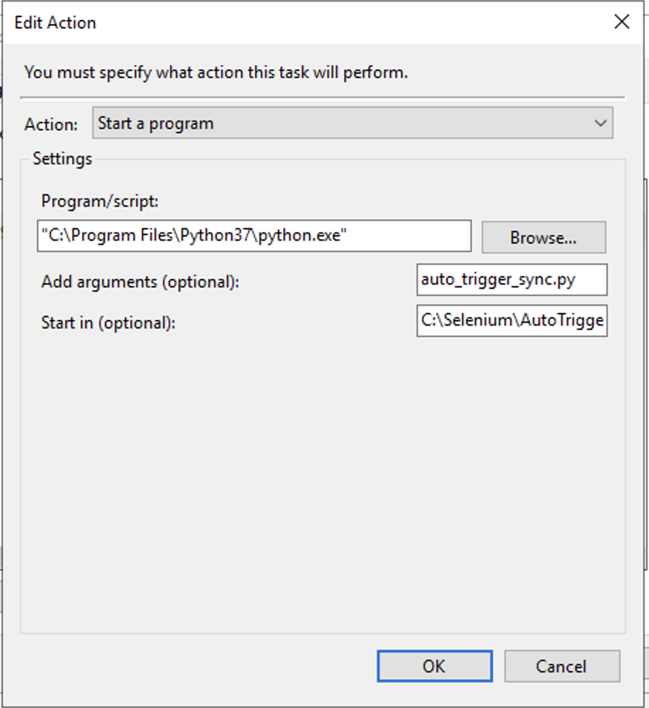
        
- Settings
    1. Click the “Settings” tab, and make sure to check the following options:
        - Allow task to be run on demand.
        - Run task as soon as possible after a scheduled start is missed.
        - If the task fails, restart every.
            
            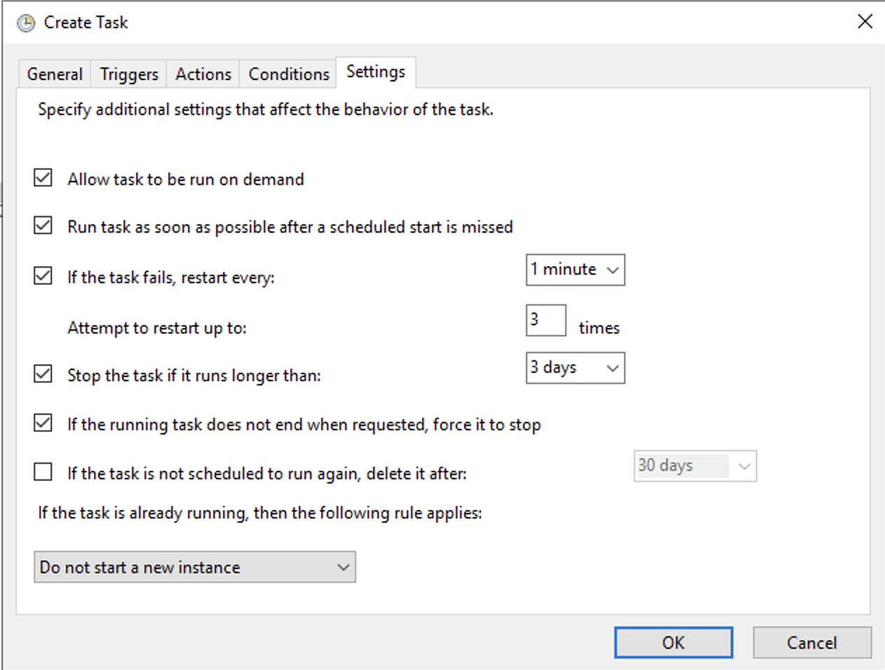
            
- Click on **OK** button

## Schedule Clear Logs

- Test Script
    
    ```bash
    ForFiles /p "C:\Selenium\AutoTriggerSync\logs" /s /d -10 /c "cmd /c del /q @file"
    ```
    
- Go to Task Scheduler > Create Task
    
    
    
- General
    1. In the “Name” box, enter a name for the task.
    2. In the “General” tab, under the “Security options” section, select the “**Run whether user is logged on or not”** option. (This option will make the command window not appear when the task runs automatically.)
        
        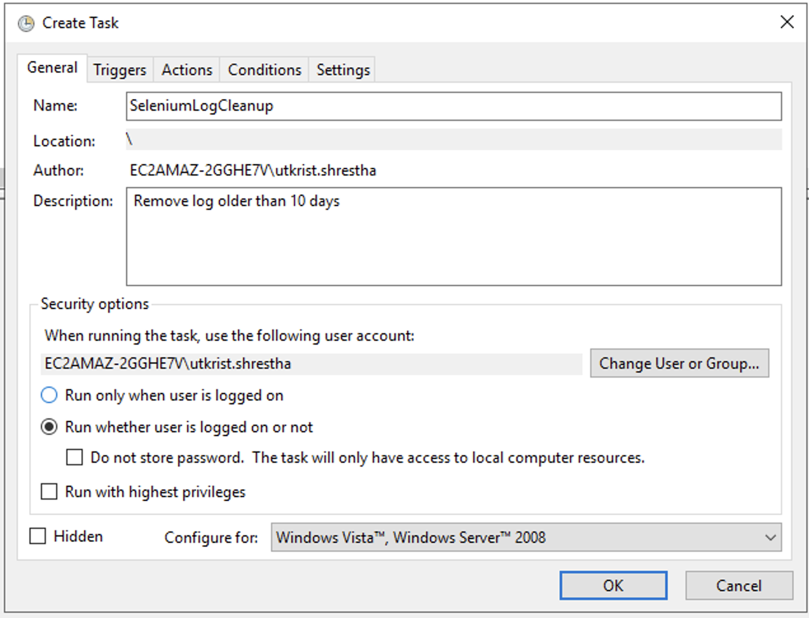
        
- Triggers
    1. Click the “Triggers” tab, and click the **New** button.
    2. Select the **“On a schedule”** option using the “Begin the task” setting.
    3. Under “Settings,” specify when you want the task to run (for example, On time, Daily, Weekly, or Monthly). Whatever option you select, set the **Start** settings on the right side.
    
    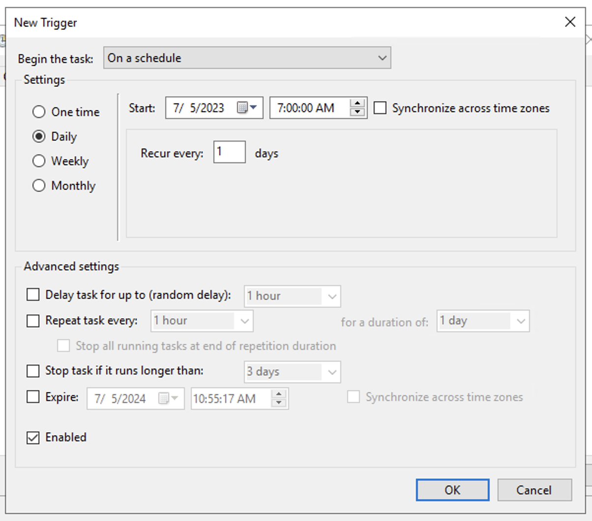
    
- Action
    1. Click the “Actions” tab, and click the **New** Button.
    2. Use the “Actions” drop-down menu and select the **“Start a program”** option.
    3. In the “Program/script” box, type the following command:
        
        ```
        ForFiles
        ```
        
    4. Type the following command in the “Add arguments” box and click the **OK** button.
        
        ```bash
        /p "C:\Selenium\AutoTriggerSync\logs" /s /d -10 /c "cmd /c del /q @file"
        ```
        
        In the command, change `"C:\Selenium\AutoTriggerSync\logs"` specifying the path to the folder that you want to delete files and change `/d -10` to select files with the last modified date.
        
        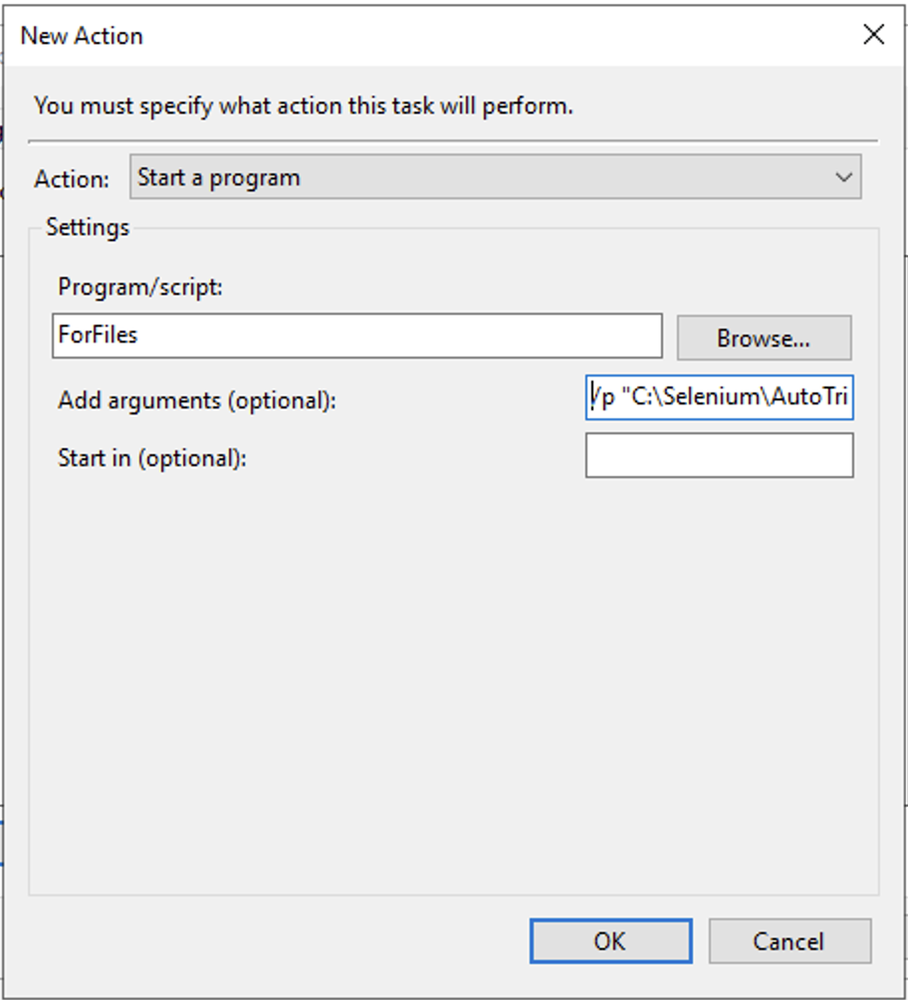
        
- Settings
    1. Click the “Settings” tab, and make sure to check the following options:
        - Allow task to be run on demand.
        - Run task as soon as possible after a scheduled start is missed.
        - If the task fails, restart every.
            
            
            
- Click on **OK** button